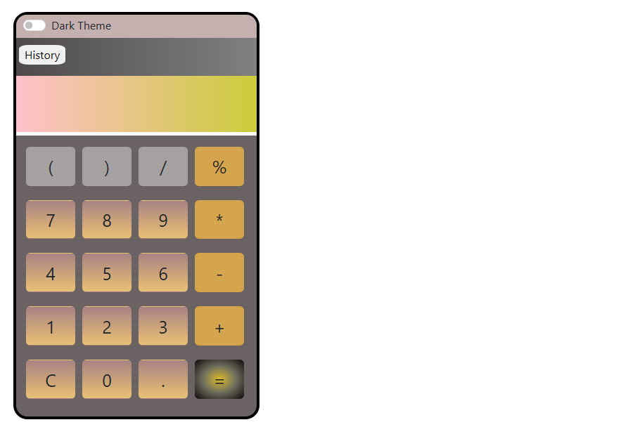
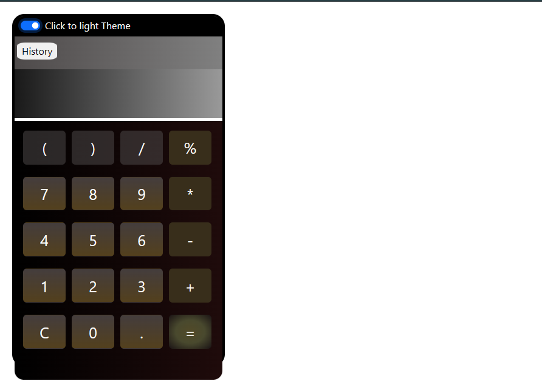

im# Calculator

A simple, responsive calculator web application created using HTML, CSS, and JavaScript. This project demonstrates basic arithmetic operations and showcases a clean, user-friendly interface.

# Features

Basic Arithmetic Operations: Supports addition, subtraction, multiplication, and division.
Responsive Design: Optimized for both desktop and mobile devices.
Clear Button: Easily reset the calculator to its initial state.

# Technologies Used

HTML: For structuring the content of the calculator.
CSS: For styling the calculator, making it visually appealing and responsive.
JavaScript: For implementing the calculator's functionality and interactivity.

# Interface

  <h1>Light Interface</h1>
</img>
 

  <h1>Dark Interface</h1>
  </img>

# Installation

Clone the repository:
Copy code
git clone https://github.com/tapeshchavle/calculator.git
Navigate to the project directory:

Copy code
cd calculator
Open the index.html file in your web browser:

bash
Copy code
open index.html

# Usage

Mouse Input: Click the buttons on the calculator interface to perform calculations.
Keyboard Input: Use the keyboard to input numbers and operators.
0-9 for numbers
+, -, \*, / for arithmetic operations
Enter to calculate the result

clear to clear the input
Screenshots

# Contributing

Contributions are welcome! Please follow these steps:

Fork the repository.
Create a new branch (git checkout -b feature-branch).
Make your changes.
Commit your changes (git commit -m 'Add some feature').
Push to the branch (git push origin feature-branch).
Open a pull request.

Contact
Name: Tapesh Chavle
Email: tapeshchawl@gmail.com
GitHub: tapeshchavle
